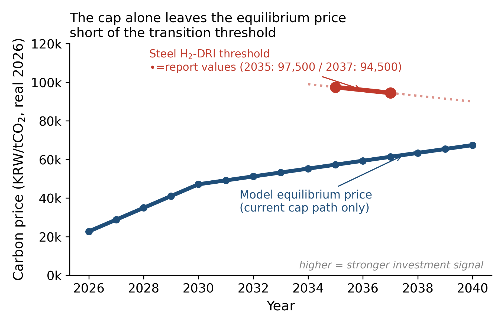
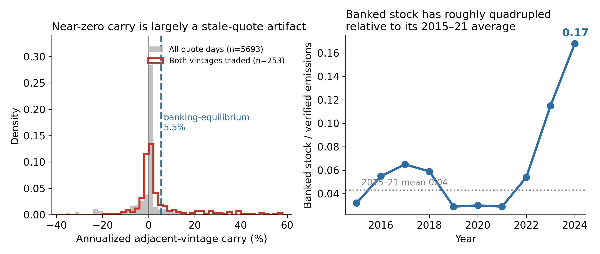
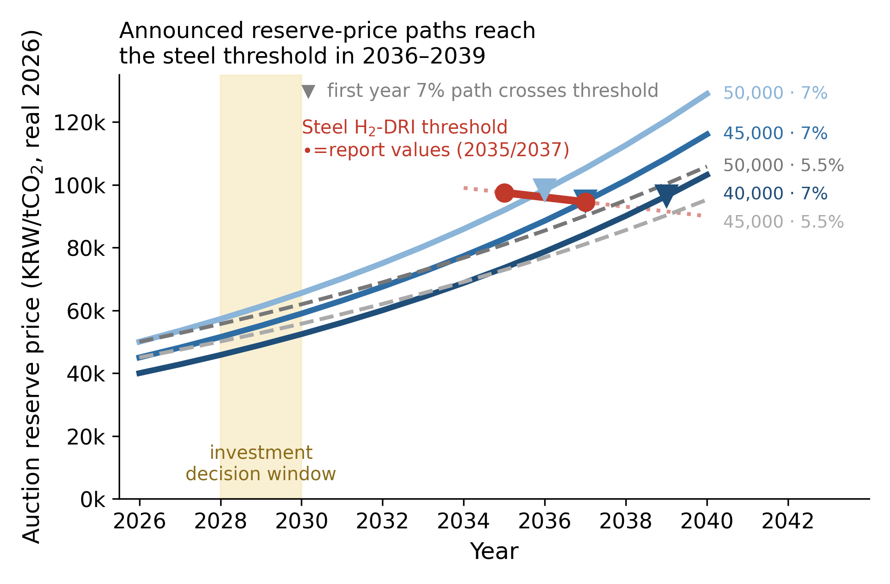
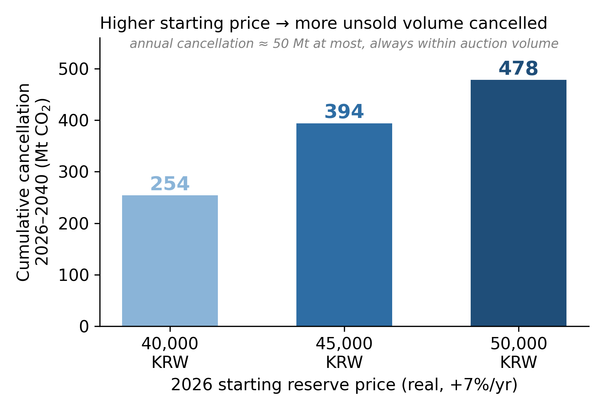

# K-ETS 배출권 가격전망과 경매 최저가격 설계

**모형 버전 v1.0 · 데이터 기준 2026-07 · PLANiT Institute**

이 문서는 이 저장소의 모형이 무엇을 계산하고 무엇을 말하는지를 배출권 시장에
익숙하지 않은 독자도 따라올 수 있게 정리한 것이다. 모든 수치는
`outputs/runs/`의 실행 결과에서 나오며, 본문의 헤드라인 수치는
`tests/test_reproducibility.py`가 자동으로 잠근다 — 엔진을 고쳐 숫자가 달라지면
테스트가 먼저 깨진다.

---

## 0. 세 문장 요약

1. **진단** — 현행 배출허용총량(cap)만으로는 KAU 가격이 2040년에도 약 6.7만 원에
   그쳐, 철강 수소환원제철(H₂-DRI)이 경제성을 갖는 문턱(2035년 기준 약 9.75만 원)에
   닿지 않는다. 총량 규제는 "언제 투자할지"를 정해주지 않는다.
2. **원인** — 한국 시장은 미래의 희소성을 오늘 가격에 옮겨오지 못한다. 인접 빈티지
   간 캐리(보유 프리미엄)의 중앙값은 사실상 0%이고, 관측 표본은 얇고 불안정하다.
   모형은 이 전달 실패를 **λ(람다)** 하나로 요약한다.
3. **처방** — 사전에 공표한 **경매 최저가격**을 실질로 매년 올리고, 그 가격에서
   **실제로 유찰된 물량은 영구 취소**한다. 2026년 4만 원 출발 · 실질 7% 상승 경로가
   기술비용 ±20% 전 범위에서 방어 가능한 유일한 출발가격이며, 2039년에 철강 문턱에
   도달한다.

---

## 1. 문제: 총량은 맞는데 신호가 늦다

배출권거래제는 총량(cap)을 정해 두고 그 안에서 가장 싼 감축부터 일어나게 한다.
이 성질은 **총량 달성**을 보장하지만 **투자 시점**은 보장하지 않는다.

단기에는 연료전환·효율개선 같은 값싼 운영개선만으로 cap을 맞출 수 있다. 그러면
한계 배출권 가격은 값싼 감축수단의 비용 근처에 머문다. 반면 2040년 목표에 필요한
수소환원제철이나 나프타 분해로 전기화(e-cracker)는 훨씬 비싸고, 건설에 10년 가까이
걸린다. 배출권 가격이 그 문턱을 넘는 시점이 너무 늦으면, 기업은 설비 교체 주기를
한 번 더 놓친다.



**그림 1.** 현행 cap이 만드는 균형가격 경로(P0)와 전환기술 문턱의 격차. 모형이
푸는 문제는 이 두 선이 만나는 시점을 앞당길 수 있는가이다.

| 연도 | P0 균형가격 (무정책 반사실) |
|---|---|
| 2026 | 22,691원 |
| 2030 | 47,135원 |
| 2040 | 67,461원 |

문턱은 철강 H₂-DRI가 2035년 약 97,500원, 2037년 약 94,500원(학습효과로 하락),
석유화학 e-cracker는 2035년 약 135,000원이다. P0에서는 두 기술 모두
**2040년까지 활성화되지 않는다**.

---

## 2. 모형: 세 층으로 나눠 푼다

가격을 한 번에 계산하지 않고, 서로 다른 질문에 답하는 세 층을 쌓는다. 세 층을
분리하는 이유는 어느 층에서 무엇이 무너지는지 보이게 하기 위해서다.

### 2층 구조의 두 극단

| 층 | 질문 | 가정 |
|---|---|---|
| **정태 균형** (Coase) | 그 해의 수요와 공급만 맞추면 가격이 얼마인가? | 이월·차익거래 전혀 없음 |
| **제약 Hotelling** | 미래 희소성을 완전히 당겨오면 얼마인가? | 완전한 이월·차익거래 (단, 이월 상한 존재) |

정태 균형은 그 해의 MACC(한계감축비용) 곡선과 cap이 만나는 점이다. MACC는 기술
단위의 **계단형(step)** 으로 구성한다 — 실제 감축수단은 매끄러운 곡선이 아니라
"이 기술을 도입하느냐 마느냐"의 덩어리이기 때문이다.

Hotelling 층은 배출권을 고갈성 자원처럼 다룬다. 이월이 자유롭다면 배출권 가격은
할인율만큼 상승해야 하고(그래야 지금 팔 이유와 나중에 팔 이유가 같아진다), 그
경로가 누적 공급을 정확히 소진해야 한다. 여기에 **이월 상한**을 얹는다 — 한국은
이월 가능 물량에 행정적 제한이 있고, 이 제약이 걸리면 기대 상승률이 통상의 보유
조건(carry condition)을 **초과할 수 있다**. 이것이 "최저가격을 이자율보다 빨리
올리면 무한 사재기가 일어난다"는 반론에 대한 이론적 답이다: 제약에 걸린 보유자는
포지션을 더 늘릴 수 없다.

### 3층: 유동성 전달 λ

한국 시장의 실제 가격은 두 극단 사이 어딘가에 있다. 그 위치를 하나의 모수로 요약한다.

```
실현가격 = 정태가격 + λ · (Hotelling가격 − 정태가격)
```

- λ = 0 → 시장이 미래를 전혀 반영하지 못함 (정태)
- λ = 1 → 완전한 시점 간 차익거래 (Hotelling)

**λ는 가정이 아니라 역산값이다.** 2026년 관측 KAU 가격을 두 극단 사이에 놓고
풀면 λ ≈ 0.55가 나온다(2026년 정태 9,862원, Hotelling 33,188원, 실현 22,691원).
2025년 스냅샷에서는 λ가 사실상 0이었다 — 2026년 상반기 재평가가 전달 채널을
부분적으로 열었다는 뜻이며, 이 변화 자체가 정책 효과의 크기를 좌우한다.

> 왜 중요한가: λ가 낮으면 "미래에 배출권이 귀해진다"는 사실이 오늘 가격에 들어오지
> 않는다. 투자 판단은 오늘 가격을 보고 이뤄지므로, 전달 실패는 곧 투자 지연이다.

---

## 3. 진단의 실증 근거: 캐리가 거의 0이다

전달 실패를 직접 관측할 수 있는가? 인접 빈티지(예: KAU24 vs KAU25) 가격 차이를 본다.
시장이 미래 희소성을 반영한다면 뒤 빈티지가 이자율만큼 비싸야 한다.

2015-01 ~ 2026-07 KRX 자료에서:

| 항목 | 값 |
|---|---|
| KAU 빈티지-일자 호가 관측 | 8,513건 |
| 같은 날 인접 빈티지 쌍 | 5,693쌍 |
| **양쪽 모두 실제 거래된 쌍** | **253쌍** |
| 유동성 필터 후 캐리 중앙값 | 0.18% |
| 같은 표본 평균 | 5.97% (연도별 편차 극심) |
| 2024년 관측 이월잔고 | 92.1 Mt |
| 이월/인증배출 비율 | 0.043 (2015–21 평균) → 0.168 (2024) |



**그림 4.** 캐리가 0에 가깝게 보이는 현상의 상당 부분은 거래 없는 정지 호가(stale
quote) 때문이다. 유동성 필터를 걸면 표본은 5,693쌍에서 253쌍으로 줄어든다.

**이 결과의 정직한 해석**: "한국 시장에 차익거래가 없다"는 것을 **증명하지 못한다**.
증명하는 것은 더 약하지만 정책적으로 충분한 명제다 — *관측된 기간구조는 장기 정책
신호로 쓰기에 너무 얇고 불안정하다.* 동시에 이월잔고는 2015–21 평균 대비 약 4배로
늘었다. 물량은 쌓이는데 그 희소성이 가격에 실리지 않는다.

---

## 4. 처방 1: 운영규칙 4종 비교

K-MSR(시장안정화 예비분)은 2026년 4월 시행령 개정으로 **이미 법제화**되었다.
따라서 남은 질문은 "도입할 것인가"가 아니라 **"어떤 규칙으로 운영할 것인가"** 이다.
모형은 네 가지 운영규칙을 같은 데이터·같은 엔진으로 비교한다.

| ID | 규칙 | 2026 | 2030 | 2040 | 최대낙폭 | 누적흡수 | 누적 경매수입 | H₂-DRI | e-NCC |
|---|---|---|---|---|---|---|---|---|---|
| **P0** | 무정책 반사실 | 22,691 | 47,135 | 67,461 | 1.0% | 0 Mt | 68.1조 | 미도입 | 미도입 |
| **P1** | 시행령 초안대로 | 34,552 | 48,452 | 67,461 | 18.2% | 31.6 Mt | 68.3조 | 미도입 | 미도입 |
| **A** | 가격약속형 (경매보류가격 회랑) | 31,506 | 55,972 | 90,000 | **7.7%** | 0 Mt | **98.6조** | **2035** | **2039** |
| **B** | 수량약속형 (2035 개시 흡수·취소) | 35,732 | 55,286 | 89,767 | 18.6% | 268.2 Mt | 98.1조 | 2035 | 2039 |

(가격 단위 원/tCO₂, 2040년 누적 경매수입 단위 조 원)

읽는 법:

- **P1(시행령 초안대로)만으로는 부족하다.** 2040년 가격이 P0와 같은 67,461원이다.
  수량 규칙은 단기 변동을 줄이지만 장기 수준을 올리지 못한다 — 흡수한 물량이
  나중에 방출되면 누적 공급이 그대로이기 때문이다(워터베드).
- **A와 B는 둘 다 문턱에 도달한다.** 차이는 경로의 성질이다. A의 최대낙폭은 7.7%,
  B는 18.6% — **가격을 약속하면 경로가 매끄럽고, 수량을 약속하면 출렁인다.**
- A는 누적 흡수량이 0이다. 하한이 신뢰되면 실제로 흡수할 일이 없다는 뜻이다.
  약속 자체가 작동하면 집행 비용이 들지 않는다.

**P0 → P1 → A로 가는 계단(gate waterfall)** 이 이 보고서의 논증 구조다: 무정책에서
시행령 초안을 얹어도 2040년 가격은 움직이지 않고, 가격 회랑을 얹어야 비로소 문턱을
넘는다.

---

## 5. 처방 2: 경매 최저가격을 얼마에서 시작해 얼마나 올릴 것인가

패키지 A를 구체적 숫자로 옮기면 두 개의 손잡이만 남는다 — **출발가격**과 **연간
실질 상승률**. 다섯 조합을 돌린다.



| 시나리오 | 2040년 하한 | 철강 문턱 도달 | e-NCC 도달 | 누적 필요보류 | 연간 최대 | 최소 여유율 |
|---|---|---|---|---|---|---|
| **4만 · 7%** | 103,141원 | **2039** | 2039 | 360.2 Mt | 50.7 Mt | 0.415 |
| 4.5만 · 7% | 116,034원 | 2037 | 2038 | 500.2 Mt | 50.7 Mt | 0.415 |
| 5만 · 7% | 128,927원 | 2036 | 2038 | 584.0 Mt | 54.7 Mt | 0.369 |
| 4.5만 · 5.5% | 95,224원 | 2040 | 2039 | 372.6 Mt | 44.6 Mt | 0.475 |
| 5만 · 5.5% | 105,805원 | 2038 | 2039 | 511.8 Mt | 50.7 Mt | 0.415 |

**다섯 조합 모두 하한을 방어한다**(`defended_all = true`). 즉 "하한을 걸어도 시장가가
그 아래로 무너져 정부가 감당 못 하는" 사태는 어느 조합에서도 나타나지 않는다.

### 필요보류량 ≠ 예상 유찰량

표의 "필요보류"는 **모형이 그 가격 경로를 지지하려면 정태적으로 얼마만큼 공급을
줄여야 하는가**이다. 실제 유찰량은 경매 수요곡선에 달려 있고, 이 모형은 경매
수요곡선을 추정하지 않는다. 두 개념을 섞지 않는 것이 이 보고서의 방법론적 핵심
중 하나다. `outputs/runs/escalator_floor_cce_v2.0.json`의 `meta.interpretation`에
같은 경고가 기계 판독 가능한 형태로 박혀 있다.



---

## 6. 실현 가능성: 경매 용량 안에 들어오는가

하한을 방어하려면 그만큼의 물량을 경매에서 빼야 한다. 그 물량이 **예정된 경매
물량을 초과하면 규칙은 집행 불가능**하다. 기술비용을 ±20% 흔들어 확인한다.

| 출발가격 | 비용 −20% | 기준 | 비용 +20% |
|---|---|---|---|
| **4만 원** | 549.5 Mt · **방어 ✅** | 360.2 Mt · ✅ | 130.8 Mt · ✅ |
| 4.5만 원 | 671.1 Mt · **방어 실패 ❌** | 500.2 Mt · ✅ | 276.4 Mt · ✅ |
| 5만 원 | 724.0 Mt · **방어 실패 ❌** | 584.0 Mt · ✅ | 365.1 Mt · ✅ |

**이 표가 정책 권고를 하나로 좁힌다.** 기술비용이 예상보다 20% 낮게 나오면 —
즉 감축이 예상보다 쉬워지면 — 필요보류량이 폭증해 4.5만·5만 원 출발은 경매 용량을
넘어선다. **4만 원 출발만이 시험한 전 범위에서 살아남는다.**

직관: 감축이 싸지면 배출권 수요가 줄어 시장가가 더 떨어지고, 그만큼 더 많이
빼내야 높은 하한을 지킬 수 있다. 야심찬 출발가격일수록 "좋은 소식"에 더 취약하다.

---

## 7. 분기점: 수소와 전력 가격이 결론을 가른다

수소·전력 가격 시나리오를 2×2로 흔들면 A와 B가 갈라진다.

| 수소 \ 전력 | 정부 투자형 | 보수적 |
|---|---|---|
| **정부 목표** | A: 철강 2035 · e-NCC 2039<br>B: 철강 2035 · e-NCC 2039 | A: 철강 2035 · e-NCC 미도입<br>B: 철강 2035 · e-NCC 미도입 |
| **보수적** | A: 철강 2035 · e-NCC 2037<br>**B: 철강 미도입** · e-NCC 2039 | A: 철강 2035 · e-NCC 미도입<br>**B: 둘 다 미도입** |

**핵심 분기**: 수소 가격이 보수적으로 가면 **B(수량약속형)에서는 H₂-DRI가 도입되지
않고, A(가격약속형)에서는 유지된다.** 수량 규칙은 "얼마나 흡수할지"를 약속할 뿐
"가격이 얼마가 될지"를 약속하지 않기 때문에, 비용이 나쁘게 나오는 국면에서 투자
신호가 무너진다. 가격 약속은 그 국면에서도 하한을 유지한다.

**A(가격약속형)가 더 강건하다** — 이것이 두 규칙 중 하나를 고르라면 A인 이유다.

---

## 8. 예상 반론

주요 반론과 답변은 원 보고서 FAQ를 요약한 것이다.

| 반론 | 답변 |
|---|---|
| 상승률 7%가 이자율보다 높으면 사재기를 부추긴다 | 이월 유인이 생기는 것은 사실이나 **그것이 의도한 전달 경로**다. §3에서 봤듯 현재 캐리는 약 0% — 미래 희소성이 오늘 가격에 없다. 또한 최저가격은 1차시장(경매) 하한일 뿐 2차시장 가격을 보증하지 않으므로 정부가 보유수익률을 보장하는 것이 아니다. |
| 산업계 비용 부담이 급증한다 | 배출량의 약 90%가 무상할당이라 직접 현금지출 영향은 제한적이다. 철강 직접 탄소비용은 2030년 약 0.6조 원/년, 문턱 도달 시 약 1.0조 원/년. 전 업종 직접비용 상한은 정의상 그 해 경매수입과 같다(2030년 약 5.8조, 2035년 약 9.2조). 이는 기업→정부 **이전**이지 사회적 순손실이 아니다. |
| 유상할당(경매 비중)을 늘리면 되지 않나 | 총공급·총수요가 같다면 무상→유상 전환만으로 균형가격은 자동 상승하지 않는다. 다만 경매 비중 확대는 가격발견과 현금비용 전달을 강화하므로 최저가격의 **보완수단**이다. |
| 정부 개입이 과도하다 | K-MSR은 배출권거래법 §23·시행령 §38로 이미 법제화되었다. 남은 선택은 **재량 운영 대 규칙 운영**이다. 예측 불가능한 재량 개입이 오히려 불확실성을 키운다. |
| 유찰 물량을 없애면 살 배출권이 모자란다 | 유찰은 시장가 < 최저가격인 초과공급 상황에서만 발생한다. 최저가격 이상 지불의사가 있는 수요자는 그 경매에서 낙찰받는다. 단, 누적 취소의 장기 영향은 별도 모니터링하고 고가 국면 상방 안전장치를 함께 설계해야 한다. |
| 해외에 전례가 있나 | 캘리포니아 경매보류가격(실질 5% + 물가), RGGI ECR(명목 7%)이 사전공표·기계적 상승의 전례다. 다만 두 제도의 실질 상승률은 5% 안팎으로, 본 분석의 실질 7%는 그보다 높은 **정책 선택**이다. |

---

## 9. 한계

이 모형이 하지 **않는** 것을 명시한다.

1. **경매 수요곡선을 추정하지 않는다.** 따라서 "필요보류량"은 유찰·취소 예측이 아니다.
2. **투자 시점을 추정하지 않는다.** 기술 문턱 통과 연도를 보고할 뿐, 기업의 실제
   투자 결정(실물옵션·불확실성 하 대기가치)을 내생화하지 않았다.
3. **소비자물가 영향을 추정하지 않는다.** 전력요금·제품가격 전가율을 포함한 별도
   분석이 필요하다.
4. **λ는 소수 관측점에서 역산했다.** 2026년 관측가 기준 0.55이며, ψ(이월제한 충격
   전달)는 문헌 범위 [−0.5, 0]로만 특정했고 점추정은 미착수다.
5. **MACC 대상은 철강·석유화학·발전 중심**이다. 전 업종을 같은 해상도로 다루지 않는다.
6. **규칙 변경 가능성을 모형화하지 않았다.** 신뢰성은 사전공표·검토주기·법적 절차를
   명시하는 제도 설계 문제로 다뤘다.

---

## 10. 이 수치를 직접 재현하는 법

```bash
pip install -r requirements-dev.txt
bash scripts/reproduce_all.sh
```

또는 단계별로:

| 명령 | 산출 | 소요 |
|---|---|---|
| `python3 scripts/export_web_data.py` | 엑셀 → `public/model/*.json` 데이터 계약 | 수 초 |
| `python3 scripts/run_model.py` | `outputs/runs/msr_results_v1.0.json` (§4 표) | 수 분 |
| `python3 scripts/run_escalator_floor.py` | `escalator_floor_cce_v2.0.json` (§5·§6 표) | 3초 |
| `python3 scripts/build_carry_analysis.py` | `carry_analysis_cce_v2.0.json` (§3 표) | 수 초 |
| `python3 scripts/build_figures.py` | `docs/figures/fig1–5.png` | 수 초 |
| `python3 -m pytest tests -q` | 헤드라인 수치 골든 검증 | ~30초 |

모든 입력은 `data/K-ETS_마스터데이터.xlsx` 한 파일에서 온다. 코드에는 데이터 숫자가
없다 — 파라미터를 바꾸려면 엑셀 시트를 고치고 파이프라인을 다시 돌린다.

방법론 상세는 [methodology.md](methodology.md), 저장소 구조와 세 가지 사용 경로
(CLI · MCP · 웹)는 [architecture.md](architecture.md)를 참조.
